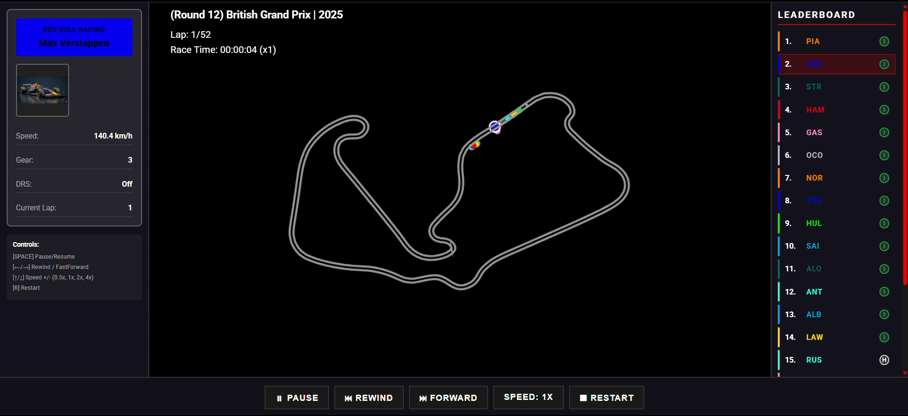
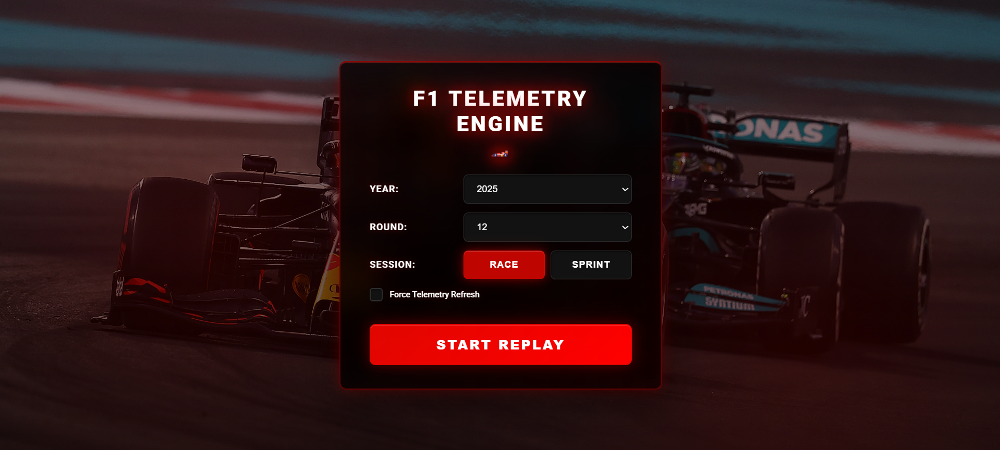

# F1 Telemetry Engine 🏎️ 🏁

A web-based Formula 1 telemetry visualization engine for replaying races with real-time interactive controls. Built with Flask.



## Features

- **Web-Based Interface:** Access the race replay from any modern web browser
- **Race Replay Visualization:** Watch the race unfold with real-time driver positions on a rendered track canvas
- **Interactive Leaderboard:** See live driver positions, current tyre compounds, and team information
- **Lap & Time Display:** Track the current lap and total race time with real-time updates
- **Driver Status Tracking:** Drivers who retire or go out are marked as "OUT" on the leaderboard
- **Interactive Controls:** Pause, rewind, fast forward, and adjust playback speed using on-screen buttons or keyboard shortcuts
- **Driver Telemetry Insights:** View detailed driver information including speed, gear, DRS status, and current lap when selecting drivers
- **Session Selection:** Choose from any F1 season, round, and session type (Race or Sprint)
- **Responsive Design:** Modern UI with smooth animations and intuitive controls





## Tech Stack

- **Backend:** Flask (Python)
- **Frontend:** HTML5, CSS3, JavaScript (Canvas API)
- **Data Source:** [FastF1](https://github.com/theOehrly/Fast-F1) library

## Requirements

- Python 3.8+
- Flask
- FastF1
- pandas, numpy, matplotlib

Install dependencies:
```bash
pip install -r requirements.txt
```

FastF1 cache folder will be created automatically on first run. If it is not created, you can manually create a folder named `.fastf1-cache` in the project root.

## Local Development

### Running the Web Application

1. **Start the Flask server:**
   ```bash
   python app.py
   ```

2. **Open your browser:**
   Navigate to `http://localhost:5000`

3. **Select a session:**
   - Choose the year, round, and session type (Race/Sprint)
   - Optionally enable "Force Telemetry Refresh" to recompute data
   - Click "START REPLAY"

### Desktop Version (Optional)

The project also includes a desktop version using Arcade:

```bash
# Run a race session
python main.py --year 2025 --round 12

# Run a Sprint session
python main.py --year 2025 --round 12 --sprint

# Force refresh telemetry data
python main.py --year 2025 --round 12 --refresh-data
```

## Web Controls

### Keyboard Shortcuts
- **SPACE** - Pause/Resume
- **← / →** - Rewind / Fast Forward
- **↑ / ↓** - Increase / Decrease playback speed (0.5x, 1x, 2x, 4x)
- **R** - Restart replay

### On-Screen Controls
- **Pause Button** - Toggle pause/resume
- **Rewind/Forward Buttons** - Navigate through the race
- **Speed Button** - Cycle through playback speeds
- **Restart Button** - Reset to beginning

### Interactive Features
- **Click on Leaderboard** - Select a driver to view detailed telemetry
- **Driver Info Panel** - Shows selected driver's speed, gear, DRS status, and current lap
- **Track Canvas** - Real-time visualization of all cars on track

## Project Structure

```
.
├── app.py                 # Flask application and API routes
├── main.py                # Desktop version entry point (Arcade)
├── src/
│   ├── f1_data.py        # Telemetry loading and processing
│   ├── arcade_replay.py  # Desktop visualization (Arcade)
│   └── lib/
│       └── tyres.py      # Tyre compound utilities
├── templates/
│   └── index.html        # Web interface template
├── static/
│   ├── css/
│   │   └── style.css    # Stylesheet
│   └── js/
│       ├── app.js        # Main application logic
│       ├── menu.js       # Session selection menu
│       └── replay.js     # Replay visualization engine
├── images/
│   ├── drivers/         # Driver car images
│   └── tyres/           # Tyre compound images
├── computed_data/       # Cached telemetry data
└── requirements.txt     # Python dependencies
```

## API Endpoints

- `GET /` - Main web interface
- `POST /api/load-session` - Load race session and return metadata
- `GET /api/get-frame/<frame_index>` - Get specific telemetry frame
- `POST /api/get-frames-batch` - Get multiple frames in batch
- `GET /images/drivers/<filename>` - Serve driver images
- `GET /images/tyres/<filename>` - Serve tyre images

## Customization

### Web Interface
- Modify UI styles in `static/css/style.css`
- Update JavaScript logic in `static/js/`
- Change HTML structure in `templates/index.html`

### Backend
- Adjust telemetry processing in `src/f1_data.py`
- Modify API endpoints in `app.py`
- Update driver/team mappings in `app.py`

### Desktop Version
- Change track visualization in `src/arcade_replay.py`
- Adjust colors and UI layout in `src/arcade_replay.py`

## Known Issues

- The leaderboard may appear inaccurate for the first few corners of the race
- Leaderboard is temporarily affected when drivers enter the pits
- At the end of the race, the leaderboard may be affected by final x,y positions
- These issues are caused by inaccuracies in the telemetry data and are being worked on for future releases

## Performance Considerations

- **Large Telemetry Data:** Race sessions can generate large amounts of data. The app uses on-demand frame loading to optimize performance
- **Memory Usage:** For very large sessions, consider optimizing data processing to reduce memory consumption
- **Processing Time:** Large telemetry processing may take time. Consider caching computed data for faster subsequent loads

## Contributing

- Open pull requests for UI improvements or new features
- Report issues on GitHub
- Suggestions for performance optimizations are welcome

## 📝 License

This project is licensed under the MIT License.

## ⚠️ Disclaimer

No copyright infringement intended. Formula 1 and related trademarks are the property of their respective owners. All data used is sourced from publicly available APIs and is used for educational and non-commercial purposes only.

---

Built with ❤️ by [Anindya Dolui](https://www.linkedin.com/in/anindyadolui/)
